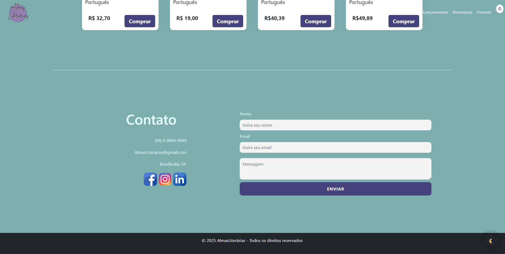
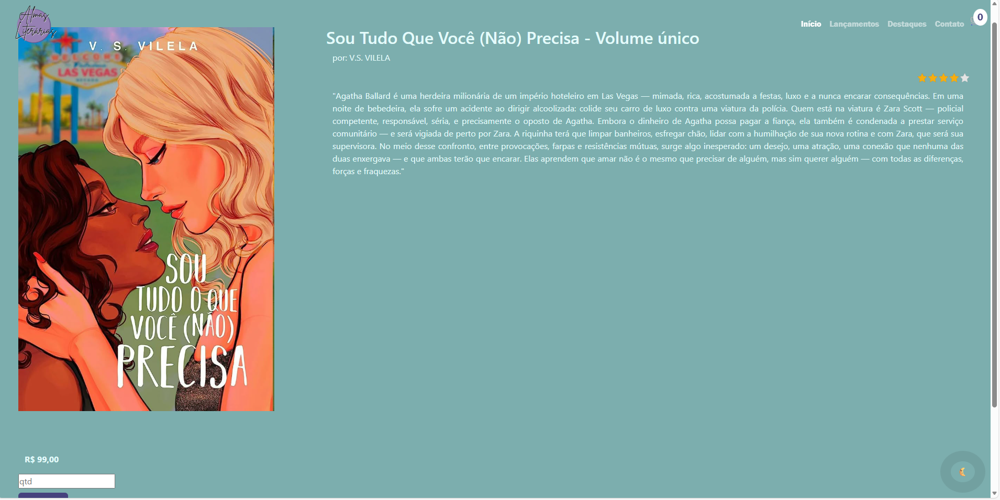

# 📚 Loja - Almas Literárias
 
Este projeto é um site de livraria desenvolvido com o objetivo de facilitar a compra de livros online de forma segura, simples e rápida. Criado durante o módulo de Front-End do curso Técnico de Informática para Internet, ele foi construído utilizando HTML, CSS, JavaScript, design responsivo e Bootstrap.

## 🎭 Funcionalidades

- Loja de livros online
- Lançamentos
- Famosos
- Colocar no carrinho
- Finalizar compra

## 🌐 Tecnologias utilizadas

- HTML
- CSS
- JavaScript
- Git e GitHub
- VS Code
- Bootstrap

## 📍 Como rodar

1. Baixe o repositório (Clique no Botão "Code" > Download Zip)
2. Extraia a Pasta
3. Abra o arquivo index.html no navegador

## 🧩 Como clonar

No terminal do VS Code digite:

    https://github.com/Sarah-ops53/Senac.git
    
No GitHub Desktop

    No menu: File(arquivi) > Clone a repositor (Clonar repositório) > Selecione a aba URL, cole o link do repositório https://github.com/Sarah-ops53/Senac.git

## 📌 Melhorias futuras

- Melhorar estilização
- Aumentar a seção de pedidos
- Adicionar filtro de categorias
- Permitir o salvamento de dados
- Ampliar os negócios para permitir um melhor acesso
- Colocar todos os cards em funcionalidade
- Melhorar o carrinho
- Completar a parte individual da compra de livros

## 📜 O que aprendi

- Aprofundar no Bootstrap
- Responsividade
- Criar comandos
- Ter conhecimento ampliado sobre front-end
- Criar pedidos no JS
- Organizar as minha pastas em um projeto real
- Subir projetos no GitHub

## 🎓 Autor

Desenvolvido por **Sarah Neves, Maria Angélica e Julia Dias**

Turma de Tecnologia em Informártica para Internet do Vespertivo - Senac DF
