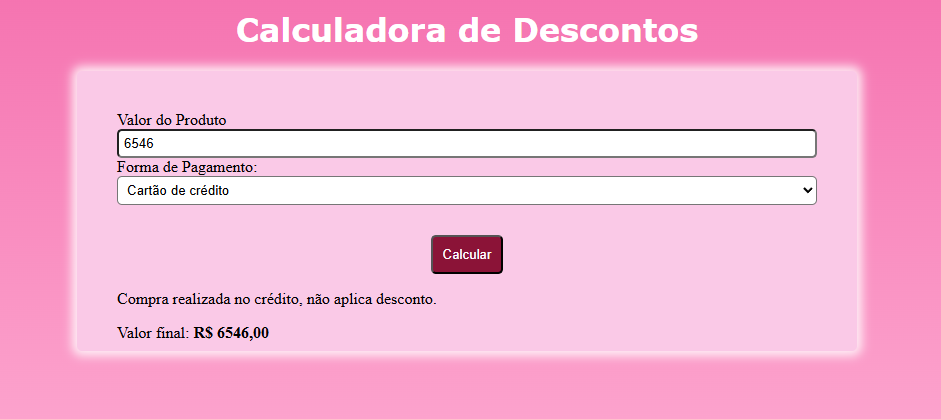

# calculadora-de-descontos

Este projeto é uma aplicação básica de uma **calculadora de descontos**. Ela calcula e registra os valores adicionados, levando em consideração a forma de pagamento do cliente. A página possui códigos simples — seu CSS, por exemplo — já que o seu principal objetivo é treinar o JS.

## Funcionalidades

- Calcular descontos segundo os critérios da forma de pagamento

## Tecnologias utilizadas

- HTML
- CSS
- JavaScript
- GitHub
- VS Code

## Como rodar

1. Baixe o repositório (Clique no Botão "Code" > Download Zip)
2. Extraia a Pasta
3. Abra o arquivo index.html no navegador

## Como clonar

No terminal do VS Code digite:
    https://github.com/Sarah-ops53/Senac.git
    
No GitHub Desktop
    No menu: File(arquivi) > Clone a repositor (Clonar repositório) > Selecione a aba URL, cole o link do repositório https://github.com/Sarah-ops53/Senac.git

Resumindo:
    Clonar é baixar o repositório completo usando Git;
    Muito utilizado em trabalhos/projetos reais.

## Melhorias futuras

- Deixar estilizado
- Adicionar filtro de categorias
- Disponibilizar a opção modo escuro
- Permitir o salvamento de dados

## O que aprendi
- A utilizar um novo código no JS

## Autor

Desenvolvido por **Sarah Neves**

Turma de Tecnologia em Informártica para Internet do Vespertivo - Senac DF
