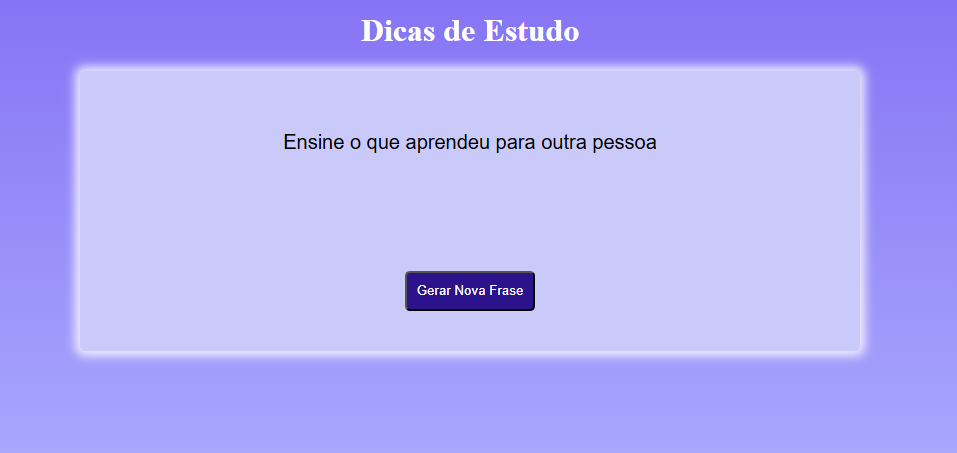

# Dicas-de-estudo

Feito para incentivar na hora dos estudos. O **dicas para estudo** tem como objetivo se aprofundar no JS de forma simples e prática, auxiliando novatos na TI. 

## Funcionalidades

- Lançar automaticamente uma dica de estudo na tela

## Tecnologias utilizadas

- HTML
- CSS
- JavaScript
- GitHub
- VS Code

## Como rodar

1. Baixe o repositório (Clique no Botão "Code" > Download Zip)
2. Extraia a Pasta
3. Abra o arquivo index.html no navegador

## Como clonar

No terminal do VS Code digite:
    https://github.com/Sarah-ops53/Senac.git

No GitHub Desktop
    No menu: File(arquivi) > Clone a repositor (Clonar repositório) > Selecione a aba URL, cole o link do repositório https://github.com/Sarah-ops53/Senac.git

Resumindo:
    Clonar é baixar o repositório completo usando Git;
    Muito utilizado em trabalhos/projetos reais.

## Melhorias futuras

- Adicionar filtro de categorias
- Disponibilizar a opção modo escuro
- Permitir o salvamento de dados

## O que aprendi

- A mexer no JS de forma simples e prática
- Se aprofundar nos códigos

## Autor

Desenvolvido por **Sarah Neves**

Turma de Tecnologia em Informártica para Internet do Vespertivo - Senac DF
